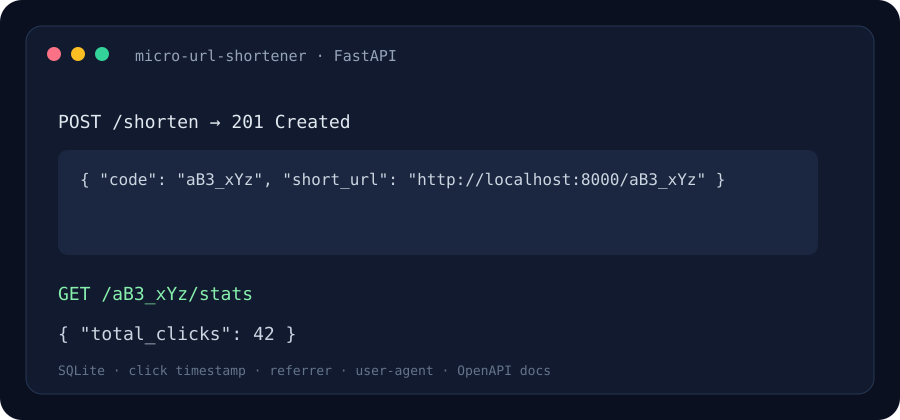

# Micro URL Shortener API

A compact FastAPI service that creates short links, redirects visitors, and stores click metadata in SQLite.

> The image above is an illustrative response preview.

## Problem it solves

Long URLs are awkward to share and provide no basic usage signal. This service creates random or custom short codes and records each redirect with a timestamp, user agent, and referrer. It does not store visitor IP addresses.

## Quick start

Requires Python 3.10 or later.

~~~powershell
python -m venv .venv
.venv\Scripts\Activate.ps1
python -m pip install -r requirements.txt
python -m uvicorn micro_url_shortener.api:app --reload
~~~

Open the interactive API docs at http://127.0.0.1:8000/docs.

## API examples

Create a short link:

~~~powershell
curl -X POST http://127.0.0.1:8000/shorten -H "Content-Type: application/json" -d "{\"url\":\"https://example.com/long/path\"}"
~~~

Use the returned short URL in a browser. Inspect aggregate click count at /{code}/stats. Add custom_code to the request body to request a readable code; it must be unique and between 4 and 24 characters.

## Endpoints

- **POST /shorten** — validates an HTTP(S) URL and creates a random or custom code.
- **GET /{code}** — records a click and issues a 302 redirect.
- **GET /{code}/stats** — returns the aggregate click count and destination.
- **GET /health** — simple process health response.

## Project layout

- **micro_url_shortener/api.py** — routes, redirect behavior, and lifespan.
- **micro_url_shortener/database.py** — SQLAlchemy models, SQLite engine, and session dependency.
- **micro_url_shortener/schemas.py** — validated API input and output.
- **assets/preview.svg** — illustrative API response preview.

## Tech stack

Python · FastAPI · Pydantic · SQLAlchemy 2 · SQLite · Uvicorn

## Production notes

The database and generated data folder are local and ignored by Git. Click metadata can be personal data; define a retention period and appropriate notice before deploying publicly. Set SHORTENER_BASE_URL when using a hostname other than localhost. The included app is a learning project and does not include authentication, rate limiting, or a user interface.

## License

MIT.
